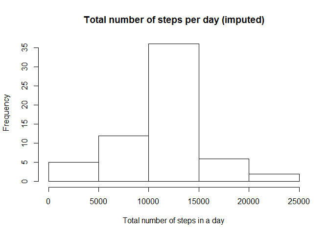

# Reproducible Research: Peer Assessment 1


```r
library(knitr)
library(dplyr)
```

```
## 
## Attaching package: 'dplyr'
## 
## The following objects are masked from 'package:stats':
## 
##     filter, lag
## 
## The following objects are masked from 'package:base':
## 
##     intersect, setdiff, setequal, union
```

```r
library(ggplot2)
```

```r
opts_chunk$set(echo=TRUE)
```

##Loading and preprocessing the data
Show any code that is needed to
1. Load the data (i.e. read.csv())
2. Process/transform the data (if necessary) into a format suitable for your
analysis

```r
dataset <- read.csv("C:/Users/Suelane/Documents/R/activity.csv", header = TRUE)
data <- dataset[ with (dataset, { !(is.na(steps)) } ), ]
head(data,20)
```

```
##     steps       date interval
## 289     0 2012-10-02        0
## 290     0 2012-10-02        5
## 291     0 2012-10-02       10
## 292     0 2012-10-02       15
## 293     0 2012-10-02       20
## 294     0 2012-10-02       25
## 295     0 2012-10-02       30
## 296     0 2012-10-02       35
## 297     0 2012-10-02       40
## 298     0 2012-10-02       45
## 299     0 2012-10-02       50
## 300     0 2012-10-02       55
## 301     0 2012-10-02      100
## 302     0 2012-10-02      105
## 303     0 2012-10-02      110
## 304     0 2012-10-02      115
## 305     0 2012-10-02      120
## 306     0 2012-10-02      125
## 307     0 2012-10-02      130
## 308     0 2012-10-02      135
```

##What is mean total number of steps taken per day?
For this part of the assignment, you can ignore the missing values in the dataset.
1. Make a histogram of the total number of steps taken each day
2. Calculate and report the mean and median total number of steps taken
per day


```r
day <- group_by(data, date)
by_day <- summarise(day, total = sum(steps))
by_day
```

```
## Source: local data frame [53 x 2]
## 
##          date total
##        (fctr) (int)
## 1  2012-10-02   126
## 2  2012-10-03 11352
## 3  2012-10-04 12116
## 4  2012-10-05 13294
## 5  2012-10-06 15420
## 6  2012-10-07 11015
## 7  2012-10-09 12811
## 8  2012-10-10  9900
## 9  2012-10-11 10304
## 10 2012-10-12 17382
## ..        ...   ...
```

```r
hist(by_day$total, main="Total number of steps per day", 
     xlab="Total number of steps in a day")
```

 

```r
summary(by_day)
```

```
##          date        total      
##  2012-10-02: 1   Min.   :   41  
##  2012-10-03: 1   1st Qu.: 8841  
##  2012-10-04: 1   Median :10765  
##  2012-10-05: 1   Mean   :10766  
##  2012-10-06: 1   3rd Qu.:13294  
##  2012-10-07: 1   Max.   :21194  
##  (Other)   :47
```
##What is the average daily activity pattern?
1. Make a time series plot (i.e. type = "l") of the 5-minute interval (x-axis)
and the average number of steps taken, averaged across all days (y-axis)
2. Which 5-minute interval, on average across all the days in the dataset,
contains the maximum number of steps?


```r
by_interval <- aggregate(steps ~ interval, data, mean)

plot(by_interval$interval, by_interval$steps, type='l', 
     main="Average number of steps over all days", xlab="Interval", 
     ylab="Average number of steps")
```

 

```r
max_row <- which.max(by_interval$steps)

by_interval[max_row, ]
```

```
##     interval    steps
## 104      835 206.1698
```

##Imputing missing values
Note that there are a number of days/intervals where there are missing values
(coded as NA). The presence of missing days may introduce bias into some
calculations or summaries of the data.
1. Calculate and report the total number of missing values in the dataset
(i.e. the total number of rows with NAs)
2. Devise a strategy for filling in all of the missing values in the dataset. The
strategy does not need to be sophisticated. For example, you could use
the mean/median for that day, or the mean for that 5-minute interval, etc.
3. Create a new dataset that is equal to the original dataset but with the
missing data filled in.
4. Make a histogram of the total number of steps taken each day and Calculate
and report the mean and median total number of steps taken per day. Do
these values differ from the estimates from the first part of the assignment?
What is the impact of imputing missing data on the estimates of the total
daily number of steps?


```r
sum(is.na(dataset))
```

```
## [1] 2304
```

```r
data_imput <- dataset
for (i in 1:nrow(data_imput)) {
  if (is.na(data_imput$steps[i])) {
    interval_value <- data_imput$interval[i]
    steps_value <- by_interval[
      by_interval$interval == interval_value,]
    data_imput$steps[i] <- steps_value$steps
  }
}
df_imput_steps_by_day <- aggregate(steps ~ date, data_imput, sum)
head(df_imput_steps_by_day)
```

```
##         date    steps
## 1 2012-10-01 10766.19
## 2 2012-10-02   126.00
## 3 2012-10-03 11352.00
## 4 2012-10-04 12116.00
## 5 2012-10-05 13294.00
## 6 2012-10-06 15420.00
```

```r
hist(df_imput_steps_by_day$steps, main="Total number of steps per day (imputed)", 
     xlab="Total number of steps in a day")
```

 
get mean and median of imputed data


```r
mean(df_imput_steps_by_day$steps)
```

```
## [1] 10766.19
```

```r
median(df_imput_steps_by_day$steps)
```

```
## [1] 10766.19
```

```r
mean(by_day$total)
```

```
## [1] 10766.19
```

```r
median(by_day$total)
```

```
## [1] 10765
```


####Are there differences in activity patterns between weekdays and weekends?
For this part the weekdays() function may be of some help here. Use the dataset with the filled-in missing values for this part.
Create a new factor variable in the dataset with two levels - "weekday" and "weekend" indicating whether a given date is a weekday or weekend day.
Make a panel plot containing a time series plot (i.e. type = "l") of the 5-minute interval (x-axis) and the average number of steps taken, averaged across all weekday days or weekend days (y-axis). See the README file in the GitHub repository to see an example of what this plot should look like using simulated data.


```r
data_imput['type_of_day'] <- weekdays(as.Date(data_imput$date))
data_imput$type_of_day[data_imput$type_of_day  %in% c('Saturday','Sunday') ] <- "weekend"
data_imput$type_of_day[data_imput$type_of_day != "weekend"] <- "weekday"
```


```r
data_imput$type_of_day <- as.factor(data_imput$type_of_day)
df_imput_steps_by_interval <- aggregate(steps ~ interval + type_of_day, data_imput, mean)
qplot(interval, 
      steps, 
      data = df_imput_steps_by_interval, 
      type = 'l', 
      geom=c("line"),
      xlab = "Interval", 
      ylab = "Number of steps", 
      main = "") +
  facet_wrap(~ type_of_day, ncol = 1)
```

 

knit2html("PA1_template.html")

